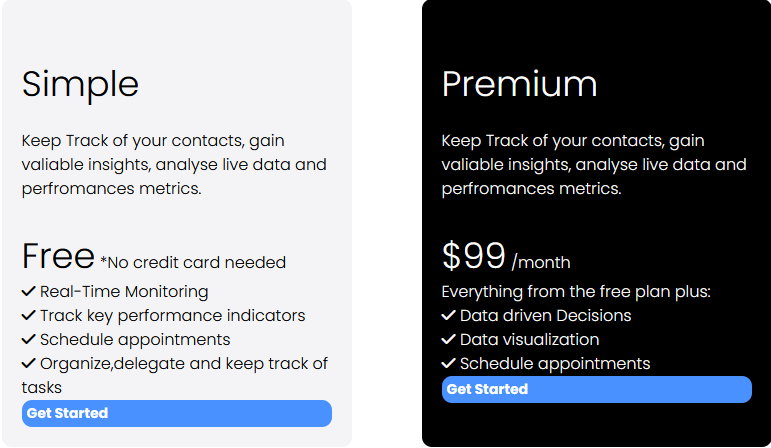

## Learning 

### parent child
```
.testimonials .card p:nth-child(2){
    margin-top: 30px;
    font-weight: bold;
}
```


### Pricing Table


#### Pricing Table html code
```
<!-- Pricing -->
    <section class="pricing">
        <div class="container-sm">
            <h3 class="pricing-heading text-xl text-center ">
                Pricing
            </h3>
            <p class="pricing-subheading text-md text-center">
                Start free and scale while you grow. No hidden fees. Unlimeted users
                for free.
            </p>
            <div class="pricing-grid">
                <!--Pricing Card 1-->
                <div class="card free bg-light">
                    <div class="pricing-card-header">
                        <h4 class="pricing-heading text-xl">
                            Simple
                        </h4>
                        <p class="pricing-card-subheading">
                            Keep Track of your contacts, gain valiable insights, analyse
                            live data and perfromances metrics.
                        </p>
                        <p class="pricing-card-price">
                            <span class="text-xl">Free</span>
                            *No credit card needed
                        </p>
                    </div>
                    <div class="pricing-card-body">
                        <ul>
                            <li>
                                <i class="fas fa-check">
                                </i>
                            Real-Time Monitoring
                        </li>
                        <li>
                            <i class="fas fa-check">
                            </i>
                        Track key performance indicators
                    </li>
                    <li>
                        <i class="fas fa-check">
                        </i>
                    Schedule appointments
                </li>
                <li>
                    <i class="fas fa-check">
                    </i>
                Organize,delegate and keep track of tasks
            </li>

                        </ul>
                        <a href="" class="btn btn-primary btn-block">Get Started</a>
                    </div>
                </div>
                <!--Pricing Card 2-->
                <div class="card premium bg-black">
                    <div class="pricing-card-header">
                        <h4 class="pricing-heading text-xl">
                            Premium
                        </h4>
                        <p class="pricing-card-subheading">
                            Keep Track of your contacts, gain valiable insights, analyse
                            live data and perfromances metrics.
                        </p>
                        <p class="pricing-card-price">
                            <span class="text-xl">$99</span>
                            /month
                        </p>
                    </div>
                    <div class="pricing-card-body">
                        <p>Everything from the free plan plus:</p>
                        <ul>
                            <li>
                                <i class="fas fa-check">
                                </i>
                            Data driven Decisions
                        </li>
                        <li>
                            <i class="fas fa-check">
                            </i>
                        Data visualization
                    </li>
                    <li>
                        <i class="fas fa-check">
                        </i>
                    Schedule appointments
                </li>
                        </ul>
                        <a href="" class="btn btn-primary btn-block">Get Started</a>
                    </div>
                </div>
                

            </div>
            <p class="pricing-footer text-center">
                All price are in USD and charged per month with applicable taxas
                addes at checkout.
            </p>


        </div>

    </section>
```

#### Pricing Table css code
```
/* Pricing*/
.pricing .pricing-grid{
    display: grid;
    grid-template-columns: repeat(2, 1fr);
    gap: 70px;
    margin-top: 50px;
}
.pricing .pricing-card-subheading{
    margin-bottom: 30px;

}
.pricing-card-price{
    
}
.pricing ul{
    
}
.pricing ul li{

}
.card.free{
}
.card{
    background: #fff;
    color: #000;
    border-radius: 10px;
    padding:20px ;
}.text-xxl{
    font-size: 3rem;
    line-height: 1.2;
    font-weight: 600;
    margin: 40px 0 20px;
}
.text-xl{
    font-size: 2.2rem;
    line-height: 1.4;
    font-weight: normal;
    margin: 40px 0 20px; 
}
.text-lg{
    font-size: 1.8rem;
    line-height: 1.4;
    font-weight: normal;
    margin: 30px 0 20px;   
}
.text-md{
    font-size: 1.2rem;
    line-height: 1.4;
    font-weight: normal;
    margin: 20px 0 10px;   
}
.text-sm{
    font-size: 0.9rem;
    line-height: 1.4;
    font-weight: normal;
    margin: 10px 0 5px;   
}
.text-center{
    text-align: center;
}
/* Background*/
.bg-primary{
    background: var(--primary-color);
    color: #fff;
}
.bg-light{
    background: var(--light-color);
}
.bg-dark{
    background: var(--dark-color);
}
.bg-black{
    background: #000;
    color: #fff;
}
```